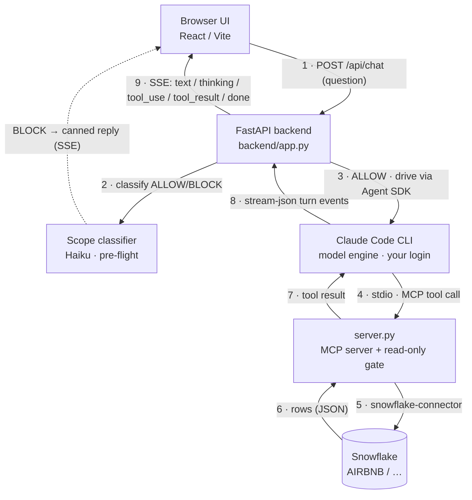

# Snowflake Chat

A standalone, **Claude-like chat app for your Snowflake account**. You ask a question
in plain English; Claude discovers the schema, writes and runs **read-only** SQL through
a self-owned MCP server, and streams the answer back as GitHub-flavored markdown tables —
reasoning, tool calls, and results all visible as they happen.

No Cortex. No separate API key or bill (it reuses your existing Claude Code login).
The tool surface and the read-only safety gate are entirely under our control.

---

## 1. End-to-end architecture



**The path of a single question:**

1. The React UI `POST`s `{prompt, session}` to `/api/chat` and opens an SSE stream.
2. **Scope pre-flight:** `backend/app.py` first runs the prompt past a cheap, warm **Haiku
   classifier** that returns `ALLOW`/`BLOCK` in ~1s. If it's off-topic (not about the user's
   Snowflake data), the backend streams a canned reply and stops here — the expensive agent
   turn never runs. On error the classifier **fails open** (allows). See decision E.
3. On `ALLOW`, `backend/app.py` hands the prompt to the **Claude Agent SDK**, which drives
   the local **Claude Code CLI** as the model engine (using your machine's existing login).
4. Claude decides which Snowflake tool to call. The SDK launches **`server.py`** as a
   local **MCP** subprocess over stdio and forwards the tool call.
5. `server.py` runs the SQL through its **permission gate** (read-only by default),
   executes it via `snowflake-connector-python`, and returns rows as JSON.
6. The SDK streams every step back to the backend — thinking, `tool_use`, `tool_result`,
   and the final answer text — which the backend re-emits as **SSE events**.
7. The UI renders the stream live: a "thinking" line, tool chips, then the markdown table.

Everything runs **locally**. Your Snowflake credentials never leave `server.py`, and the
question/answer traffic goes only to the Claude engine you already use for Claude Code.

---

## 2. Components

| Component                  | File(s)               | Responsibility                                                                                                                              |
| -------------------------- | --------------------- | ------------------------------------------------------------------------------------------------------------------------------------------- |
| **MCP server**             | `server.py`           | Snowflake connection, statement classifier + permission gate, 7 read-only tools. Pure `mcp` SDK + `snowflake-connector-python` + `sqlglot`. |
| **Backend / orchestrator** | `backend/app.py`      | FastAPI. Owns the Claude Agent SDK sessions, configures the MCP server inline, streams turns over SSE, serves the built frontend in prod.   |
| **Frontend**               | `frontend/`           | Vite + React + TypeScript + Tailwind v4 + shadcn/ui. Health gate, SSE chat, markdown tables, tool chips, dark theme.                        |
| **CLI tester**             | `query.py`            | Run a query straight against `server.py`'s logic without the full stack.                                                                    |
| **Agents**                 | `.claude/agents/*.md` | Data-engineer + frontend-engineer subagent personas used during development.                                                                |
| **Portable Node**          | `.tools/node`         | Self-contained Node runtime for the frontend (no global install; moves with the repo).                                                      |

### The 7 MCP tools (`mcp__snowflake__*`)

- `get_connection_info` — account / user / role / warehouse / db / schema / version / mode
- `execute_query(sql)` — run one gated SQL statement, rows as JSON
- `list_databases` · `list_schemas(database)` · `list_tables(schema, database)`
- `describe_table(table)` — columns & types
- `preview_table(table, limit)` — sample rows (capped at 100)

### SSE event contract (backend ↔ frontend)

- `GET /api/health` → `{ ready, checks:[{name, ok, detail}], message }` (preflight gate)
- `POST /api/chat {prompt, session}` → SSE `data: {json}\n\n`, where `type` ∈
  `text | thinking | tool_use | tool_result | error | done`
- `POST /api/reset {session}` → clears one conversation

---

## 3. Key decisions & why

### A. Self-owned MCP server, no Cortex

**Decision:** Build our own MCP server on the open protocol + the official Snowflake
connector, rather than use Cortex or a vendor MCP.
**Why:** We control the exact tool surface and the safety gate, and we depend only on
stable, documented interfaces. This is what makes the roadmap (DDL → RCA → self-healing)
safe to grow into without re-platforming. Nothing built for A1 gets thrown away later.

### B. Claude Agent SDK reusing the Claude Code login (not the raw API)

**Decision:** The backend drives the local Claude Code CLI via the Agent SDK instead of
calling the Claude API with an API key.
**Why:** Zero extra credentials and **no separate bill** — it runs on the login you
already have. It also gives us the full agentic loop (multi-step tool use, thinking,
streaming) for free, which is exactly the behavior a data-exploration chat needs.

### C. Read-only permission gate, classified by first keyword

**Decision:** `server.py` classifies each statement by its leading keyword and, in the
default `read_only` mode, permits only `SELECT / SHOW / DESCRIBE / EXPLAIN / USE /
VALUES / LIST / GET`. It also rejects multi-statement calls and classifies `WITH` CTEs
by their terminal statement.
**Why:** Safety by construction — the model literally cannot mutate data or schema in the
default mode; a blocked write returns an explanatory error instead of executing.
**Consequence (this is why a JOIN runs):** the gate cares about what a statement _does_,
not how complex it is. A JOIN, subquery, CTE, window function, or aggregation is still a
`SELECT` — a **read** — so it's allowed. "Read-only" means _no changes to data or schema_,
**not** "simple queries only." Only statements whose first keyword writes (`INSERT`,
`UPDATE`, `DELETE`, `MERGE`, `COPY`, …) or changes schema (`CREATE`, `ALTER`, `DROP`, …)
are rejected.

### D. `ENABLE_TOOL_SEARCH=0` — offer the Snowflake tools directly

**Decision:** The backend passes `env={"ENABLE_TOOL_SEARCH": "0"}` to the Agent SDK.
**Why:** With tool search on, the CLI **defers** MCP tools behind a server-side
`ToolSearch` tool — the model must discover a tool by exact name before it can call it.
For a natural question ("what tables are in AIRBNB?") the model searched by _keyword_,
found nothing, and wrongly reported the Snowflake tools as unavailable. Turning tool
search off offers all 7 `mcp__snowflake__*` tools to the model directly, so it just calls
them. (Note: setting `tools=[]` is **not** a substitute — it also removes `ToolSearch`
itself, leaving no path to the still-deferred MCP tools.)

### E. Scope guard — keep it on-topic (Snowflake only)

**Decision:** Two layers stop the app being used as a general chatbot.

(1) A **SCOPE rule**
in the system prompt tells the model to decline anything unrelated to the user's Snowflake
data.

(2) A **pre-flight classifier** — one warm, shared **Haiku** client — judges each
prompt `ALLOW`/`BLOCK` in ~1s _before_ the expensive agent turn runs; off-topic prompts get
a canned reply and never reach the agent. The toolset is also locked to Snowflake only
(via `tools=[]`; see decision F), so the model can't fetch external info even if asked.
**Why:** The read-only gate only governs _SQL/tools_ — it can't stop the model answering,
say, "latest NBA news" from its own training knowledge (no tool needed). The classifier is
the hard, cheap backstop; the system-prompt rule is defense-in-depth for the rare case the
classifier fails **open** (by design, a classifier error allows the message rather than
blocking a legitimate user). Verified: NBA/weather/election → declined in ~1.2s; data
questions and follow-ups ("and the next 5?") → allowed.

### F. Inline MCP config, strict/self-contained SDK options, tool lockdown

**Decision:** `make_options()` passes the MCP server config inline and sets
`strict_mcp_config=True`, `setting_sources=[]`, `permission_mode="bypassPermissions"`, and
**`tools=[]`** (which disables every built-in Claude Code tool — Bash, web, file edit — so
only the 7 `mcp__snowflake__*` tools remain; verified they stay reachable because tool
search is off).
**Why:** The app is self-contained and reproducible — it uses **only** our Snowflake
server and ignores any other MCP config or project/user settings on the machine, so it
behaves the same everywhere. `bypassPermissions` is safe here precisely _because_ the
read-only gate in `server.py` and the empty built-in toolset are the real backstops.

### G. Single-server production mode

**Decision:** In prod, `app.py` mounts the built `frontend/dist` at `/`, so one process
serves both the UI and the API on port **8000**. Dev mode instead runs Vite on 5173 with
a `/api → 8000` proxy for hot reload.
**Why:** One command, one port, nothing to orchestrate for normal use; the split dev
setup exists only when you're actively editing the frontend.

### H. Per-session Agent SDK client, streamed over SSE

**Decision:** Each `session` id gets its own long-lived `ClaudeSDKClient` (guarded by an
async lock); turns stream to the browser as Server-Sent Events.
**Why:** Conversation memory per session, and the user sees reasoning/tool calls/results
as they happen instead of waiting for one big response.

### I. Portable Node, venv-based Python

**Decision:** Node lives in `.tools/node` (no global install); Python runs from the repo
`.venv`.
**Why:** The toolchain is self-contained and moves with the repo — no machine-wide setup,
and the exact runtimes are pinned.

---

## 4. Running it

**Prod (one server):**

```powershell
cd <repo>\snowflake-mcp-claude
.venv\Scripts\python.exe backend\app.py     # serves UI + API on http://127.0.0.1:8000
```

**Dev (hot reload) — two terminals:**

```powershell
# terminal 1 — backend on 8000
.venv\Scripts\python.exe backend\app.py

# terminal 2 — Vite on 5173 (proxies /api -> 8000)
cd frontend
$env:PATH = "<repo>\snowflake-mcp-claude\.tools\node;$env:PATH"   # put portable Node on PATH
npm run dev            # open http://localhost:5173
```

**Rebuild the frontend after edits** (prod picks it up on reload):

```powershell
cd frontend
$env:PATH = "<repo>\snowflake-mcp-claude\.tools\node;$env:PATH"
npm run build
```

The backend's `/api/health` is a preflight: it must show **all green** (server file,
`.env`, Claude engine + login, MCP connection) before chatting.

---

## 5. Configuration (`.env`, gitignored)

| Var                                                       | Purpose                                                         |
| --------------------------------------------------------- | --------------------------------------------------------------- |
| `SNOWFLAKE_ACCOUNT` / `_USER` / `_PASSWORD`               | Connection credentials                                          |
| `SNOWFLAKE_ROLE` / `_WAREHOUSE` / `_DATABASE` / `_SCHEMA` | Session context (all optional)                                  |
| `SNOWFLAKE_MCP_MODE`                                      | Permission mode — `read_only` (default) / `read_write` / `full` |
| `SNOWFLAKE_MCP_MAX_ROWS`                                  | Row cap per query (default 1000)                                |

**Permission modes:**

| Mode                  | Allows                                                              |
| --------------------- | ------------------------------------------------------------------- |
| `read_only` (default) | SELECT / SHOW / DESCRIBE / EXPLAIN / USE / VALUES / LIST / GET      |
| `read_write`          | the above + INSERT / UPDATE / DELETE / MERGE / COPY / PUT           |
| `full`                | the above + DDL (CREATE/ALTER/DROP/…) + admin (GRANT/REVOKE/CALL/…) |

Change the mode in `.env`, then restart the backend.

---

## 6. Roadmap (additive — nothing gets thrown away)

- **A1 (current):** read-only SQL + discovery tools.
- **A2:** DDL/DML via `read_write` / `full` mode + confirmation on destructive ops.
- **A3:** RCA / observability tools (QUERY_HISTORY, TASK_HISTORY, COPY_HISTORY, profiling).
- **A4:** self-healing actions with dry-run, approval gates, audit log, and a scoped role.

---

## 7. Operational notes & gotchas

- **Run the backend from this folder with the `.venv` Python.** `app.py` resolves all
  paths (`server.py`, `.env`, `frontend/dist`) relative to itself. Launching a copy from
  the wrong directory or with system Python is the usual cause of a red `/api/health`.
- **Port 8000** must match the Vite dev proxy target. If you change the backend port,
  update `frontend/vite.config.ts` too.
- **The `.venv` is not relocatable.** After moving the repo, recreate it:
  `py -m venv .venv && .venv\Scripts\python.exe -m pip install -r requirements.txt`.
- **Scoped role for the future.** It currently connects as ACCOUNTADMIN; move to a scoped
  role before enabling write/self-healing modes (A4).
- **Primary target data:** database `AIRBNB`, schema `DBT_SCHEMA`, warehouse `COMPUTE_WH`.

---

## 8. Future plans — deploying for colleague testing

Goal: let colleagues try the app. Today it runs **locally on one machine**. Getting others
onto it is **not** a free choice of "any deployment × any auth" — the two are hard-coupled
by Anthropic's terms. Read this constraint first; it decides everything else.

> ### ⚠️ The decisive rule: how you deploy dictates how you may authenticate
>
> **A Claude *subscription* (Pro/Max/Team login) may only power *ordinary personal use* of
> Claude Code.** Per Anthropic's Usage Policy (Feb 2026), a third-party app may **not**
> route requests through subscription credentials **on behalf of other users** — and this
> is actively enforced. To serve multiple people from a backend you **must** use an
> **Anthropic API key** (Claude Console, per-token billing).
>
> This means there is **no "hosted webapp on a subscription" option** — not even with each
> colleague pasting their own subscription token, because the app is still a third party
> routing their subscription requests. Subscriptions are fine *only* when each colleague
> runs the app themselves (that's their own ordinary use).

### The allowed combinations (auth × deployment)

| Deployment | Claude **subscription** (Code login / setup-token) | Claude **API key** |
| --- | --- | --- |
| **Per-user-local** — each colleague runs the app on their own machine | ✅ **Allowed** — their own ordinary use; **no per-token bill** | ✅ Allowed |
| **Hosted webapp** — one backend, colleagues just open a URL (no install) | ❌ **Not permitted** — even with per-user pasted tokens | ✅ **Required** — service-account key *or* per-user keys (per-token bill) |

**So you pick one coherent bundle — not a mix:**

- **Bundle A — Subscription → must be Per-user-local.** No API cost; each colleague uses
  their own Claude Code login. Cost: they install & run the app themselves.
- **Bundle B — Hosted webapp (no VM) → must use API keys.** Zero install for colleagues,
  deployable to a managed container platform. Cost: per-token API billing, plus real
  networking/auth work.

### Bundle B in detail — hosted webapp, **no VM to provision**

A "webapp" here still means a **container** (the app spawns the Claude CLI + MCP
subprocesses, holds per-session state, and streams SSE — so *not* a serverless function).
Ship a `Dockerfile` to a **managed container platform** (Google **Cloud Run**, AWS
**App Runner**, Azure **Container Apps**, Render, Fly.io) — they run the image; **you never
provision or patch a VM.**

1. **Claude auth:** `ANTHROPIC_API_KEY` via `ClaudeAgentOptions.env`. Either one
   **service-account key** (simplest; you pay) or **each colleague pastes their own key at
   onboarding** (they pay, self-contained). Revisits decision **B** (login → API key); the
   rest of the code is unchanged.
2. **Snowflake:** a dedicated **scoped read-only role** — *not* ACCOUNTADMIN. Either one
   shared role in server config, or each colleague enters their own creds at onboarding.
3. **Onboarding wizard (if per-user creds):** turn the `/api/health` gate into a setup
   screen; a new `POST /api/setup` validates the pasted API key + Snowflake creds and holds
   them **per-session in memory** (never on disk/logs). Inject Snowflake creds as `env` on
   that session's MCP subprocess and the API key via the SDK client's `env`.
4. **Access control (mandatory — it's now on a public URL):** put it behind company
   **SSO / an identity-aware proxy / VPN**, or at minimum a shared password, over **HTTPS**
   (the platform provides TLS). Never expose a Snowflake-querying app open.
5. **One warm instance:** sessions (and any per-user secrets) live in memory → pin
   min=max=1 or use sticky sessions, else autoscaling splits conversations / loses creds.

#### Capping API spend to a fixed monthly budget (Pro-plan-style cost)

The API bills per token, but you can **bound it to a flat monthly ceiling** so it behaves
like a subscription — e.g. cap it at ~$20/month to mirror a Claude Pro plan's price. Do it
at two layers:

**Layer 1 — Anthropic Console (the hard ceiling; ~5 min, no code):**
- Create a **dedicated workspace** for this app and generate its API key there, so limits
  apply only to this app.
- Set a **monthly spend limit** on that workspace (Console → Limits/Billing). When hit, the
  API returns errors and the app stops spending — a true ceiling you can't overrun.
- Set per-workspace **rate limits** (RPM / input-TPM / output-TPM) to bound burst cost.
- *Caveat:* Console spend limits are **monthly** and workspace-wide, not daily or per-user.

**Layer 2 — app side (daily + per-user granularity):**
- Every turn, the Agent SDK's `ResultMessage` already carries `total_cost_usd` and `usage`
  (token counts). `stream_turn` receives it today but only reads `duration_ms`.
- Accumulate that cost into an in-memory tracker (daily reset; keyed globally and per
  session/user) and short-circuit new turns past a configurable limit — the same
  short-circuit pattern the scope classifier uses. Suggested `.env` knobs:
  `DAILY_COST_LIMIT_USD`, `PER_USER_DAILY_MSGS`, plus a per-turn output cap.

> ⚠️ **"Identical to Pro" means identical *price*, not identical *capacity*.** A $20/month
> API cap fixes your cost at Pro's price, but $20 of tokens is a specific token budget — it
> does **not** reproduce Pro's interactive usage allowance. Match the billing ceiling, not
> the usage limits. Treat the **Console spend limit as the billing source of truth**;
> `total_cost_usd` is a real-time gating signal, not an accounting figure.

### Bundle A in detail — per-user-local, onboarding screen

Turn the `/api/health` gate into a **setup wizard**: detect the Claude Code login → prompt
the user to run `claude` to log in if missing; collect Snowflake creds in a form → a new
`POST /api/setup` validates + persists them + resets the session. This dissolves networking,
shared-credential, and access-control concerns entirely (it's all localhost), at the cost of
each colleague installing Python + the app and having their own Claude Code login.

#### Colleagues do NOT run `npm run dev`

`npm run dev` is the **development** workflow (hot-reload while editing the frontend) — no
colleague ever needs it. In **prod mode**, `app.py` serves the pre-built `frontend/dist` at
`/`, so the frontend is built **once** and shipped as static files; at runtime a colleague
just **starts the backend and opens `http://127.0.0.1:8000`** — no Vite, no npm, no Node at
runtime at all. A local server does have to be running while in use, but that's *one* action
(below), not the two-terminal dev dance.

#### Distribution / launch options (least → most polished)

| Option | Colleague experience | Effort to build |
| --- | --- | --- |
| **A. Run script** | Double-click `start.ps1` (activate venv → launch backend → auto-open browser); close the window to stop. Pair with a one-time `setup.ps1` (create venv, `pip install`, build `dist` once). | ~15 min |
| **B. Auto-start service** | Backend runs on login in the background; the app is just "always there" at `localhost:8000`. | ~1 hr (Windows Task/Service) |
| **C. Packaged `.exe`** (PyInstaller) | A single `SnowChat.exe` — **no** Python, venv, or Node needed. Double-click → browser opens. | ~half a day, and one build per OS |

**The friction that actually matters is first-time setup, not launch.** Per machine:
- **Python + venv + `pip install`** — the `.venv` isn't relocatable, so it's created per
  machine. **Option C** bundles Python away entirely and removes this.
- **Claude Code installed + logged in** — their own subscription; the prerequisite that makes
  this route compliant (see §8's decisive rule).
- **Snowflake creds** — handled by the onboarding wizard (or a hand-written `.env`).
- **Node is not needed at runtime** — `dist` is platform-independent static files; a colleague
  only needs Node if they rebuild the frontend, which they don't.

**Recommendation:** if colleagues already use Claude Code (so they're technical enough),
**Option A** is the sweet spot — a one-time `setup.ps1` + a double-clickable `start.ps1`, no
dev commands, no per-use hassle. Go to **Option C** only if you want a truly zero-prerequisite
hand-off (an `.exe` someone just runs).

### Decisions still to be made

- [ ] **The bundle:** A (subscription + per-user-local, no API cost, they install) vs
      B (hosted webapp + API keys, zero install, per-token cost). *This is the fork above.*
- [ ] **If B — key model:** one service-account key (you pay) vs per-user keys at onboarding
      (they pay).
- [ ] **If B — host & access control:** which managed platform (Cloud Run / App Runner /
      Container Apps), and SSO vs proxy vs shared password.
- [ ] **If A — launch method:** run script (double-click `start.ps1`) vs auto-start service
      vs packaged `.exe`. *(Recommended: run script.)*
- [ ] **Snowflake role:** create the scoped read-only role + warehouse the app connects as
      (shared, or per-user via onboarding).
- [ ] **Speed (either bundle):** a quick throwaway test first (tunnel-from-this-machine for
      B, or a zip for A) vs a proper packaged deploy.

### Known technical hurdles

- **Cross-platform CLI.** The Agent SDK bundles a *platform-specific* Claude Code binary
  (currently Windows). A Linux container needs Claude Code for Linux installed and the
  `ANTHROPIC_API_KEY` path verified end-to-end — **validate this first**; it's the riskiest
  step. (Auth-by-key in a container is far less fragile than a headless login.)
- **Bundled Node is Windows-only** (`.tools/node`). A Linux build needs its own Node
  (handled inside the Docker image).
- **Concurrency.** Each active session spawns its own Claude CLI subprocess; the scope
  classifier is a shared singleton behind a lock. Fine for a handful of testers, not a
  crowd — size the container accordingly.

### Mechanism footnotes (verified against Anthropic docs, Feb 2026)

- Subscription headless auth exists (`claude setup-token` → `CLAUDE_CODE_OAUTH_TOKEN`,
  ~1-year token, no CLI revoke yet) — but is **only** for the account owner's own use, not
  multi-user serving (see the rule above).
- Both `ANTHROPIC_API_KEY` and `CLAUDE_CODE_OAUTH_TOKEN` are settable per-invocation via
  `ClaudeAgentOptions.env`.
- Sources: Claude Code Authentication docs; Claude Code Legal & Compliance (Usage Policy,
  Feb 2026); Agent SDK Python reference.
